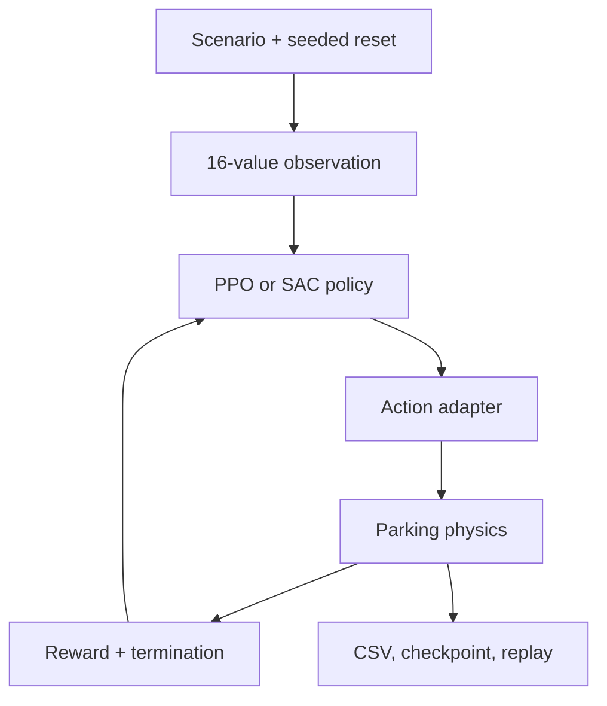

# Parking RL Lab

[](https://github.com/cagataykavas/neuralTrainer/actions/workflows/ci.yml)

A self-contained reinforcement-learning environment for autonomous parking. It combines oriented-rectangle physics, configurable parking scenarios, PPO and SAC agents, residual control, and a curriculum that moves one policy from coarse discrete commands to continuous steering and throttle.

This is an engineering portfolio project, not a claim that parking is solved. The repository includes runnable verification and an experiment protocol; trained-policy performance should be reported only after multi-seed evaluation.

## Why this project is interesting

- One stable policy representation spans 9 commands, 43 commands, an annealed transition, and continuous control.
- PPO supports categorical and squashed-Gaussian policies; SAC uses twin critics and automatic entropy tuning.
- A geometric controller can be used as a residual-RL baseline.
- Collision checks use the separating axis theorem on rotated rectangles.
- Training supports multiple cars, custom JSON layouts, checkpoints, CSV logs, and replay rendering in a separate process.
- `--describe-json` exposes the observation, action, termination, artifact, and resolved-configuration contract in machine-readable form.

## Quick verification

```bash
python -m venv .venv
source .venv/bin/activate  # Windows: .venv\Scripts\activate
python -m pip install -e ".[dev]"

python parking_rl.py --smoke-test
python parking_rl.py --describe-json
pytest
```

The smoke test checks both neural-policy families, the action tables, collision geometry, reset semantics, and a complete environment step. It prints a JSON report and does not start training.

## Train and interact

```bash
# Headless curriculum training
python parking_rl.py \
  --mode TRAIN \
  --algorithm PPO \
  --action-mode CURRICULUM \
  --scenario RANDOM \
  --episodes 500 \
  --headless

# Continuous SAC
python parking_rl.py --mode TRAIN --algorithm SAC --action-mode CONTINUOUS --episodes 500 --headless

# Load the latest matching checkpoint
python parking_rl.py --mode INFERENCE --algorithm PPO --action-mode CURRICULUM

# Drive the first car with W/A/S/D; R resets and Q exits
python parking_rl.py --mode PLAY --action-mode CONTINUOUS
```

The central `CONFIG` dictionary remains available for reward ablations, curriculum lengths, residual control, rendering cadence, and custom checkpoint paths.

## System design



| Control mode | Executed command | Policy-head strategy |
|---|---:|---|
| `DISCRETE_9` | 9 steering/throttle pairs | PPO categorical or quantized motor policy |
| `DISCRETE_43` | 42 grid pairs + neutral | PPO categorical or quantized motor policy |
| `CONTINUOUS` | 2 values in `[-1, 1]` | Squashed Gaussian |
| `CURRICULUM` | 9 → 43 → blended → continuous | Stable 2D latent motor policy |

The default observation has 13 geometric values plus a three-value hierarchical phase indicator: approach, align, or settle. See [architecture](docs/ARCHITECTURE.md) for the state and reward contracts.

## Scenarios and outputs

Built-in scenarios are `SIMPLE`, `WALLS`, and randomized selection. `CUSTOM` loads cars, lots, and walls from JSON; [the U-shaped example](examples/u_shape_trap.json) documents the schema.

Runs write to `parking_rl_output/` by default:

- `training_log.csv` — episode, curriculum stage, reward, steps, success count, and replay status
- `checkpoints/` — best, latest, and curriculum-boundary model snapshots
- optional asynchronous episode replays — visualization never blocks the learner

For defensible comparisons, use fixed seed splits and report success rate, collision rate, timeout rate, final position/alignment error, and episode length. The [experiment guide](docs/EXPERIMENT_GUIDE.md) gives a concrete protocol.

## Repository map

```text
parking_rl.py                 self-contained environment, agents, training, CLI
examples/u_shape_trap.json    custom-scenario example
tests/test_parking_rl.py      physics, curriculum, scenario, and contract tests
docs/ARCHITECTURE.md          design decisions and interfaces
docs/EXPERIMENT_GUIDE.md      reproducible evaluation protocol
```

## Current evidence

- Static compilation passes.
- Automated tests cover geometry, seeded resets, custom scenario loading, curriculum boundaries, and the JSON contract.
- The smoke path executes PPO and SAC forward passes and one environment transition.
- No benchmark score is advertised yet; convergence and multi-seed results remain experiment work rather than README theatre.

