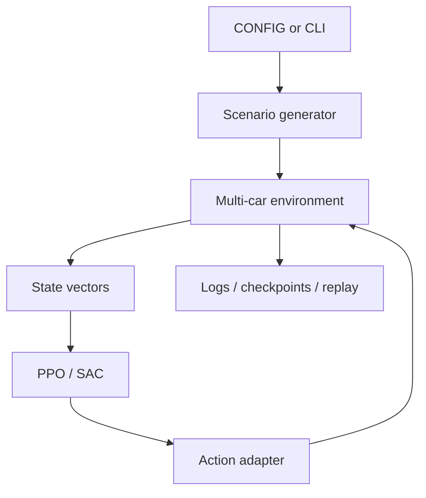

# Architecture

Parking RL Lab deliberately stays in one Python module so the complete environment-to-update path can be audited without framework indirection. The boundaries are still explicit enough to extract into a package later.

## Runtime flow



### Environment

`CarParkingEnvMulti` owns cars, assigned parking lots, walls, episode clocks, previous controls, and done flags. Every entity is an oriented rectangle. Collision tests project both rectangles onto the normals of all edges; a separating axis means no collision.

The dynamics are intentionally lightweight:

```text
heading(t+1) = heading(t) + turn_scale * steer
speed(t+1)   = speed_offset + speed_scale * throttle
position     = position + speed * heading_vector
```

This makes curriculum and reward experiments cheap. A bicycle model with steering and acceleration state is an explicit future fidelity upgrade, not something the current simulator pretends to implement.

### Observation contract

The base vector contains 13 values:

1. normalized car x/y;
2. heading as cosine/sine;
3. normalized car length/width;
4. normalized target dx/dy/distance;
5. relative target bearing and parking alignment;
6. normalized lot length/width.

With hierarchical state enabled, three one-hot values identify approach, align, or settle, producing 16 dimensions. `python parking_rl.py --describe-json` emits the exact resolved contract.

### Action adapter

The adapter separates the policy representation from the command executed by the simulator. A continuous two-value latent action can be snapped to the nearest 9- or 43-command table. During the annealing phase, the executed action interpolates between the nearest discrete command and the latent continuous command.

For SAC, the torch path uses a straight-through estimator so the forward pass executes a quantized command while gradients flow through the continuous command. Optional residual control adds a scaled learned correction to a geometric controller before quantization.

### Learning algorithms

- PPO: generalized advantage estimation, clipped objective, value loss, entropy bonus, minibatch epochs, and gradient clipping.
- SAC: squashed Gaussian actor, twin critics and targets, replay buffer, entropy temperature optimization, and Polyak target updates.

PPO in fixed discrete modes uses a categorical head. The curriculum uses one stable two-dimensional Gaussian head, avoiding incompatible 9-class, 43-class, and continuous checkpoints.

### Rewards and termination

The shaped reward combines clipped distance progress, target-bearing preference, straight-motion bonus, time cost, direction-change cost, idle and steering-waggle penalties, and configurable terminal terms. An episode ends on successful containment/alignment/low-speed parking, collision, leaving the map, or the step limit.

The training log keeps reward and success counts separate. Reward is an optimization signal; success rate is the task metric.

### Rendering and artifacts

Selected training episodes are copied as geometry snapshots into a bounded multiprocessing queue. A separate process replays them with Matplotlib. A full queue drops visualization work instead of stalling training. Checkpoints store model state, optimizer state, curriculum stage, episode, best reward, and the resolved config.

## Known limitations

- Kinematic dynamics omit slip, wheelbase, steering-rate limits, and actuator lag.
- The state has no range sensors or explicit wall rays.
- The built-in training loop does not yet maintain separate validation and test seed suites.
- A successful smoke test verifies integration, not learning convergence.

